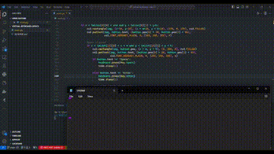

# Computer Vesion Virtual Keyboard 🖥️👋

## 🚀 Overview

Welcome to the Computer Vesion  Virtual Keyboard project! This innovative application uses computer vision and hand tracking to create a virtual keyboard that you can type with using just your hands in the air. Perfect for futuristic interfaces, accessibility solutions, or just plain fun!

## ✨ Features

- 🖐️ Real-time hand tracking
- ⌨️ Full QWERTY keyboard layout
- 🔤 Special keys: Space, Enter, and Backspace
- 🎨 Visually appealing UI with semi-transparent overlay
- 📸 Works with your computer's webcam

## 🛠️ Technologies Used

- Python
- OpenCV
- CVZone
- Numpy
- Pynput

## 🎥 Demo

Check out this LinkedIn post showcasing the Virtual Keyboard in action:

<iframe src="https://www.linkedin.com/embed/feed/update/urn:li:ugcPost:7183088669799653376" height="530" width="504" frameborder="0" allowfullscreen="" title="Embedded post"></iframe>

[View on LinkedIn](https://www.linkedin.com/posts/gazi-faysal-jubayer_project-virtual-keyboard-practicing-computer-activity-7183088670483132416-sRoG)

## 🚀 Getting Started

1. Clone this repository
2. Install the required dependencies:
`pip install opencv-python cvzone numpy pynput`
3. Run the main script:
`python virtual_keyboard.py`

## 🎮 How to Use

1. Launch the application and position yourself in front of your webcam.
2. Hold up your hand in view of the camera.
3. Move your index finger to hover over keys.
4. To "press" a key, bring your middle finger close to your index finger.
5. Watch the magic happen as you type in thin air!

## 🧠 How It Works

This project utilizes advanced computer vision techniques to:
1. Detect and track hand movements in real-time.
2. Identify specific finger positions and gestures.
3. Map these gestures to virtual key presses.
4. Render an overlay of the keyboard on the video feed.
5. Process "clicks" and input the corresponding text.

## 🛠️ Customization

Feel free to modify the `keys` list in the code to create your own keyboard layouts or add additional functionality!

## 📚 Learn More

Interested in the technicalities? Check out these key components of the project:
- Hand tracking with CVZone
- Creating interactive buttons with OpenCV
- Simulating keyboard inputs with Pynput

## 🤝 Contributing

Contributions, issues, and feature requests are welcome! Feel free to check [issues page](https://github.com/gazi-faysal-jubayer/virtual-keyboard-opnCV/issues).

<!-- ## 📝 License

This project is [MIT](link_to_your_license) licensed. -->

## 📞 Contact

Gazi Faysal Jubayer - [LinkedIn](https://www.linkedin.com/in/gazi-faysal-jubayer) - gazi.faysal.jubayer@gmail.com

Project Link: [https://github.com/gazi-faysal-jubayer/virtual-keyboard-opnCV](https://github.com/gazi-faysal-jubayer/virtual-keyboard-opnCV)

---

Made with ❤️ by Gazi Faysal Jubayer

